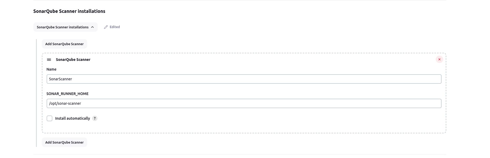
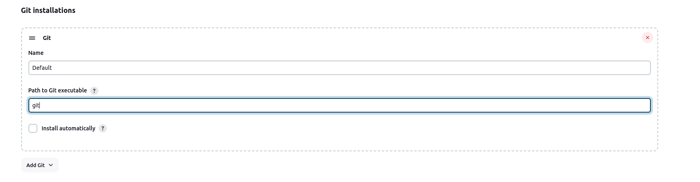
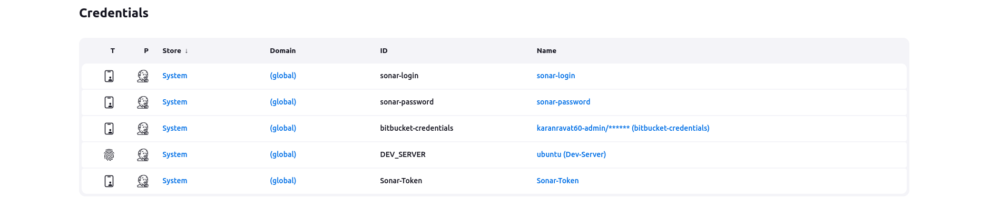
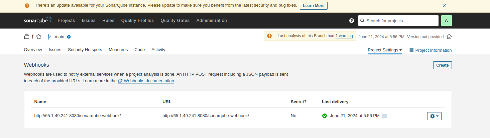
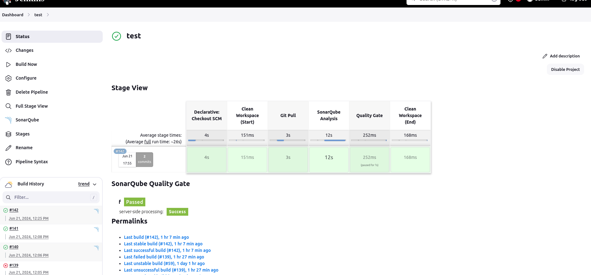
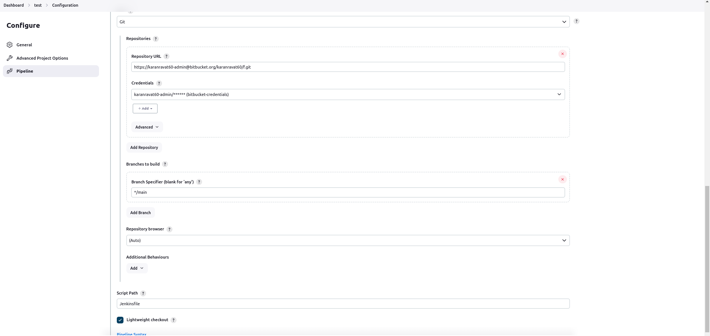

# sonarqube setup and add with jenkins
# Setup Link - Sonarqube - https://gist.github.com/dmancloud/0abf6ad0cb16e1bce2e907f457c8fce9
# Setup Link - Sonar Scanner - https://medium.com/@humzaarshadkhan/sonarqube-installation-on-ubuntu-20-04-9c4f8e293870

